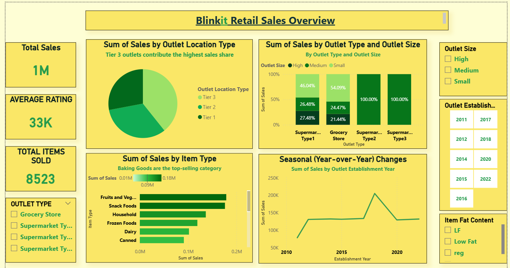

# blinkit-sales-analysis
Data-driven retail sales analysis for Blinkit to guide strategy on outlet expansion and product focus.
# Sales Performance Analysis – Power BI

## 📌 Project Overview
This project analyzes sales data to uncover patterns in customer segments, product preferences, and yearly trends.  
The insights help guide strategic decisions for outlet expansion, inventory planning, and revenue growth.

## 📊 Dashboard Preview
  

---

## 🔍 Insightful Analysis
- **Top Performers:** Tier 3 outlets bring in the most sales; medium and high-sized outlets also lead in revenue.
- **Best-Selling Products:** Baking Goods rank highest, followed by Fruits & Vegetables and Snack Foods.
- **Trends Over Time:** A sales peak in 2020 (likely tied to external events) was followed by a plateau.
- **Efficiency at Scale:** Larger outlets cost more to operate but deliver higher sales.

---

## 💡 Business Conclusion
- Expand **Tier 3 outlets** and maintain strong stock for top-selling categories.
- Prioritize opening **medium and high-sized outlets** to maximize returns.
- Investigate **2020’s sales spike** to replicate success strategies.
- Keep **flexible inventory planning** to respond to sudden changes in demand.

---

## 🛠 Tools Used
- **Power BI** – Data visualization & analysis
- **Excel** – Data cleaning & preparation
- **GitHub** – Project documentation

---

## 📂 Repository Structure
